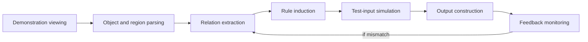
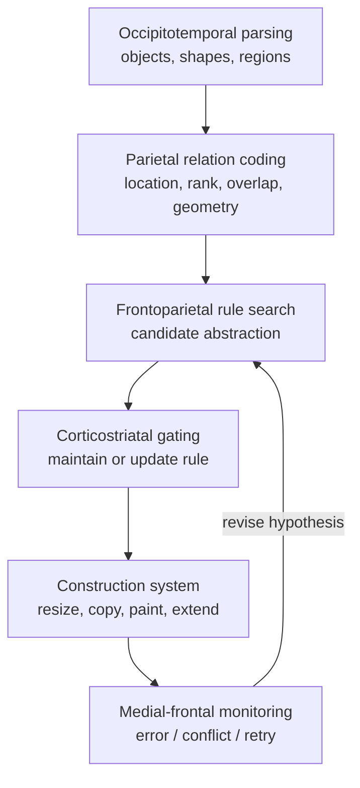

# Neural Mapping of Human Problem Solving in H-ARC Tasks

## Executive summary

ARC-AGI-1 is a benchmark of 800 public grid-transformation tasks designed to probe fluid, few-shot abstraction under tightly limited priors; each task contains a small set of input-output demonstrations and one or more test inputs, and a solution is correct only if every test output is exactly right. H-ARC is the human behavioral companion dataset for the original ARC benchmark: it evaluates 1,729 people on the full 400 training and 400 evaluation tasks, releases their submissions and action traces, and reports average human performance around 76.2% on the training set and 64.2% on the public evaluation set, with 790 of 800 public tasks solved by at least one person in three tries. citeturn3view0turn1view5turn4view0turn46academia0turn1view2

For this report, because the request did not specify task count and because publicly verified human instruction data are richest for ARC training tasks, I define an **analytic H-ARC subset** as six ARC-AGI-1 training tasks that satisfy four criteria: they are in the official ARC database, appear in H-ARC with public participant traces, overlap with LARC verified natural-language instructions, and span distinct cognitive primitives such as enclosure, object translation, ordinal comparison, logical overlap, pattern continuation, and compositional geometry. LARC augments 354 of the 400 ARC training tasks with at least one human-validated “natural program,” and records both describer and builder actions. citeturn3view0turn4view0turn35view0turn35view1

Across the selected tasks, the most defensible cognitive-level account is an **object-centric, frontoparietally controlled program-induction loop**. Humans first parse colored cells into objects or regions, then encode relations such as containment, contact, height ordering, overlap, or continuation, then induce a compact rule, simulate that rule on the test input, construct the output, and use feedback to revise if needed. Prior human ARC work found that many first actions are either output-grid resizing or copying the input, that participants converge through intermediate object-centered bottleneck states, and that their verbal descriptions cluster strongly within tasks. The selected H-ARC task pages show the same pattern: easy contact-based tasks are often solved in one attempt, while enclosure, recoloring, and compositional-extension tasks elicit informative second- and third-attempt corrections. citeturn34view0turn33view0turn7view0turn37view0turn37view1turn37view2turn38view0turn39view0

The brain mapping is necessarily **indirect** because, in the sources reviewed, ARC/H-ARC/LARC studies report behavior, instructions, actions, and errors, but not neural recordings. The strongest operation-to-brain assignments are these: ventral visual areas including LOC for object-form encoding; inferior and superior intraparietal sulcus for object individuation, spatial indexing, and feature-rich object identification; IPS-centered parietal magnitude systems for height and numerosity comparisons; dorsolateral/frontoparietal control systems for rule maintenance and multi-step search; corticostriatal gating for deciding what to keep in working memory; and ACC/pre-SMA-centered monitoring systems for detecting incorrect attempts and triggering revisions. Language appears important as a scaffold for explicit rule formulation and communication, but the evidence reviewed supports it more strongly as a **helper system** than as the sole engine of inference. citeturn56search1turn51search0turn58search3turn57search0turn48search0turn35view1turn34view0

The best validation strategy is a convergent program of **task-resolved fMRI, time-resolved EEG, lesion comparisons, and—when available—intracranial recordings**, using ARC task families that isolate enclosure, translation-to-contact, ordinal ranking, conjunction/intersection, and compositional geometry. The key prediction is not a single “ARC area,” but a reproducible sequence: occipitotemporal parsing, parietal relation coding, frontoparietal hypothesis selection and maintenance, then medial-frontal error monitoring when a candidate rule fails. citeturn34view0turn35view1turn48search0turn58search7turn58search4

## Defining H-ARC and selecting the analytic subset

ARC-AGI-1 is the official public benchmark released by François Chollet’s repository. The repository specifies 400 training tasks and 400 evaluation tasks, with each task stored as JSON containing training demonstrations and test examples. Test-takers are considered to solve a task only when they produce the correct output for all test inputs, and the benchmark allows three trials per test input. ARC’s design goal is to emphasize fluid reasoning over culture-specific knowledge, using “core knowledge priors” rather than domain-specific memorization. citeturn3view0turn1view5

**H-ARC**, in the official recent sense, is the large-scale human dataset spanning both the ARC training and evaluation sets. The H-ARC release describes step-by-step action traces, participant submissions, errors, and natural-language solution descriptions, and the associated performance paper reports a robust human estimate on the full public ARC benchmark. citeturn4view0turn46academia0

For the purposes of this report, I use **H-ARC** in two nested senses. The first is the official full dataset just described. The second is an **analytic subset** of H-ARC tasks chosen for brain-mapping analysis. Because the user did not specify the number of tasks, I selected six public training tasks in order to balance diversity with interpretability. Restricting to training tasks is methodologically justified because LARC’s human-validated instruction corpus covers ARC training tasks, not the full public evaluation split, and because the report explicitly asked for “human instruction examples.” citeturn35view0turn35view1turn1view4turn5view0

The operational selection criteria were:

| Criterion | Operational definition | Why it matters |
|---|---|---|
| Official ARC membership | Task is in ARC-AGI-1 training set | Keeps the subset anchored to the canonical benchmark. citeturn3view0 |
| H-ARC trace availability | Public H-ARC task page includes participant attempts and descriptions | Provides directly observed human behavior rather than only inferred strategy. citeturn7view0turn37view0turn37view1turn37view2turn38view0turn39view0 |
| LARC instruction overlap | Task has successful natural-language instruction examples in LARC | Adds human-interpretable “programs” for decomposition. citeturn35view0turn35view1turn36view0 |
| Cognitive diversity | Tasks span distinct primitives | Avoids overfitting the neuroscience mapping to one family such as simple translation. citeturn34view0turn36view0 |

## Dataset of selected tasks and human traces

Using the public LARC summary files together with H-ARC task pages, the selected subset contains six ARC training tasks with verified instruction examples and public human attempts. The task families range from simple one-step object contact to multi-part constructive geometry. Counts of verified LARC descriptions below are derived from the public LARC `task.csv`, `description.csv`, and `join.csv` summary files. citeturn13view0turn31view0turn31view1

| ARC task | Transformation family | Representative H-ARC trace pattern | Representative LARC instruction gist | Verified LARC descriptions |
|---|---|---|---|---:|
| `00d62c1b` | Fill enclosed holes | Some participants immediately identify “closed holes,” while others over-copy or over-fill; one participant succeeds only on the third try, showing the need to distinguish enclosed from merely adjacent empty space. citeturn37view0 | Keep grid size unchanged; detect enclosed holes in the green pattern; fill those holes yellow. citeturn36view0 | 4 |
| `05f2a901` | Move object until contact | Public H-ARC examples are highly convergent: participants usually solve it in one try and describe moving the red shape toward the cyan/blue square until touching. citeturn7view0 | Keep the blue object fixed; move the other shape until it touches the blue object. citeturn36view0 | 2 |
| `08ed6ac7` | Rank bars by height and recolor | Participants usually verbalize an ordered mapping: tallest→blue, second→red, third→green, shortest→yellow. Errors mostly reflect failure to infer the ranking rule. citeturn37view1 | Keep grid size unchanged; recolor gray bars according to ordinal height rank. citeturn36view0 | 2 |
| `0520fde7` | Intersection / logical overlap | Successful participants explicitly describe overlap or “AND”-like logic; failures often just copy the input or vaguely describe filling. citeturn37view2 | Partition the two sides, compare corresponding cells, and color red where both sides are colored. citeturn36view0 | 3 |
| `017c7c7b` | Extend pattern and remap color | Many participants first catch the extension rule but miss the color substitution, then correct on attempt two. citeturn38view0 | Resize to `3×9`; continue the existing pattern; convert blue elements to red. citeturn36view0 | 2 |
| `0962bcdd` | Multi-rule geometric composition | Some participants solve immediately, but others first miss the diagonal or offset extension and then correct after feedback. citeturn39view0 | Keep size unchanged; extend the plus-sign arms and create a diagonal X in the center color. citeturn36view0 | 4 |

Two features of this subset are especially important for brain mapping. First, different tasks stress different primitives: enclosure and topology in `00d62c1b`, object translation and contact in `05f2a901`, ordinal magnitude comparison in `08ed6ac7`, relational conjunction in `0520fde7`, sequential pattern completion in `017c7c7b`, and multi-rule composition in `0962bcdd`. Second, the H-ARC and LARC materials together expose both **online solving** and **post hoc program description**, which lets us separate “what the person did” from “how the person later explained it.” citeturn37view0turn7view0turn37view1turn37view2turn38view0turn39view0turn35view1

The broader human ARC literature strengthens this interpretation. In the earlier 40-task human ARC study, average human accuracy was high, many first actions were output resizing or copying the test input, and state-space analyses revealed object-based bottlenecks rather than arbitrary search trajectories. That makes H-ARC especially valuable for neuroscience because it suggests that human ARC behavior is neither pure pixel matching nor unconstrained symbolic search; it is structured around intermediate object-like states. citeturn33view0turn34view0

The diagram above summarizes the process model that best fits the combined ARC, H-ARC, LARC, and earlier human-ARC evidence reviewed here. It is not yet a neural model; it is the cognitive scaffold that the neural mapping below will anchor to. citeturn3view0turn34view0turn35view1turn46academia0

## Cognitive decomposition of human H-ARC solving

The most stable decomposition across these tasks begins with **perceptual parsing**. Humans do not appear to treat ARC grids as undifferentiated arrays of cells. Instead, they rapidly describe “holes,” “bars,” “plus signs,” “shapes,” “cubes,” “overlap,” and “touching,” which implies an early conversion from cell arrays into object- or region-level representations. LARC’s phrase annotations make this explicit, with heavy use of object-detection, spatial-relation, procedure, and visual-transform tags across the selected tasks. citeturn36view0turn34view0

The next step is **relation coding**. In `00d62c1b`, the relevant relation is containment or closure; in `05f2a901`, it is translation toward contact while preserving object identity; in `08ed6ac7`, it is ordinal rank by vertical extent; in `0520fde7`, it is same-position overlap across partitions; in `017c7c7b`, it is continuation under resized output; and in `0962bcdd`, it is composition of orthogonal and diagonal extensions. These are not the same operation, but they share a deeper form: the solver must identify **which relation stays invariant across demonstrations** and which surface features are incidental. citeturn37view0turn7view0turn37view1turn37view2turn38view0turn39view0

Humans then appear to form a compact **task rule or latent program**. The earlier human ARC study observed that language within a task is much more consistent than shuffled task labels would predict, and LARC was explicitly designed to capture successful natural programs that one human can communicate to another well enough for the second person to build the correct output. That makes it plausible that successful ARC solving often involves an internal rule that is at least partially compressible into a short verbal or quasi-verbal program. citeturn34view0turn35view0turn35view1

After rule induction comes **simulation on the test input**. Here the solver must apply the inferred latent rule to a novel grid, select or construct the correct output size, and then instantiate the transformed objects or regions. H-ARC traces show that people often pass through intermediate construction states rather than jumping directly to the answer, and task-specific errors are usually “close” to the correct answer in objecthood, shape, or one properly inferred relation. That is exactly what one expects from a simulation-first, not brute-force, strategy. citeturn34view0turn37view2turn38view0turn39view0

Finally, there is **monitoring and revision**. H-ARC pages are valuable here because they expose first-attempt misunderstandings that are informative rather than random. In `017c7c7b`, participants often discover only after feedback that the task requires not just vertical continuation but also a blue→red substitution. In `0962bcdd`, some participants first miss a diagonal offset or omit an outer square before correcting on the second attempt. In `00d62c1b`, some overgeneralize the filling rule before tightening it to genuinely enclosed regions. These are classic signatures of constrained hypothesis revision. citeturn37view0turn38view0turn39view0

## Brain mappings and computational mechanisms

The table below maps the recurring cognitive operations in the selected H-ARC tasks to the most plausible neural substrates. The key caveat is that these are **reverse-inference mappings** from component processes to brain systems, not direct ARC neuroimaging results. I therefore label the evidence strength conservatively.

| Cognitive operation | Likely brain systems and circuits | Likely computational role | Evidence strength | Representative support |
|---|---|---|---|---|
| Object and region parsing | Ventral visual system including LOC, plus occipitoparietal interactions | Bind color and shape into object-like units; distinguish figure from background; represent discernible shapes | Strong for the component process, indirect for ARC | LOC is consistently implicated in structural object recognition and responsiveness to discernible shapes. citeturn56search1turn57search4 |
| Object individuation and spatial indexing | Inferior IPS for object individuation; superior IPS plus higher visual areas for richer object identification | Maintain tokenized object files and their positions so that objects can be counted, moved, compared, or preserved | Strong for the component process, indirect for ARC | Neural-object-file accounts place individuation in inferior IPS and richer identification in superior IPS and higher visual cortex. citeturn51search0 |
| Spatial transformation and visuomotor construction | IPS/SPL with premotor visuomotor circuits | Translate shapes, extend lines, align objects, and construct outputs under coordinate constraints | Moderate | IPS is tied to perceptual-motor coordination, visual attention, and object manipulation; human ARC action traces show construction through intermediate states. citeturn58search7turn34view0 |
| Magnitude comparison and ordinal mapping | IPS-centered parietal magnitude system, with support from lateral frontal control regions | Compare bar heights, order objects, map rank to color | Strong for the component process, indirect for ARC | Numerical/size-comparison work ties parietal systems, particularly IPS, to magnitude and comparison judgments. citeturn58search3turn47search3 |
| Rule maintenance and selective updating | DLPFC with corticostriatal gating loops involving basal ganglia | Keep the current hypothesis active while updating only task-relevant state variables | Moderate | PBWM-style accounts argue for gated prefrontal maintenance controlled by basal-ganglia mechanisms. citeturn57search0turn52search0 |
| Cross-example integration and multi-rule composition | Distributed frontoparietal control network, likely including more anterior prefrontal regions when rules must be combined | Align multiple demonstrations, evaluate candidate abstractions, compose subrules | Moderate to tentative | General intelligence accounts emphasize parieto-frontal integration; human ARC behavior shows abstraction over demonstrations rather than local pixel matching. citeturn58search4turn34view0turn35view1 |
| Error monitoring and revision | ACC and pre-SMA / medial-frontal monitoring system | Detect conflict or incorrect attempts; trigger post-error adjustments and hypothesis revision | Strong for the component process, indirect for ARC | ERN literature ties error signals to medial frontal monitoring, especially ACC; H-ARC traces show informative second-attempt corrections. citeturn48search0turn37view0turn38view0turn39view0 |
| Language-mediated rule scaffolding | Likely optional recruitment of left-hemisphere language systems interacting with frontoparietal control | Externalize, compress, validate, and communicate task rules | Tentative | LARC shows that successful natural programs contain framing, validation, and clarification, while earlier human ARC work links task difficulty to description length and nameability. citeturn35view1turn34view0 |

This mapping suggests a **distributed architecture** rather than a single reasoning module. The strongest picture is: ventral visual areas form candidate objects and shapes; parietal systems maintain spatially indexed tokens and encode geometry, rank, and overlap; frontoparietal control systems evaluate candidate rules across demonstrations; corticostriatal loops stabilize or update currently active hypotheses; and medial frontal systems monitor failure and initiate repair. In ARC terms, the brain is likely solving these tasks through repeated negotiation between **what is seen**, **what relation is invariant**, and **what action program should be executed next**. citeturn51search0turn56search1turn58search3turn57search0turn48search0turn34view0

Task-by-task, the dominant load is not uniform. `05f2a901` should be the cleanest example of object individuation plus spatial translation-to-contact. `00d62c1b` should emphasize contour/region parsing plus inhibitory constraint, because the solver must avoid filling spaces that are not fully enclosed. `08ed6ac7` should emphasize parietal comparison and ordinal mapping. `0520fde7` should emphasize working-memory alignment of corresponding subgrids and a conjunction-like rule. `017c7c7b` should place extra load on output-size planning plus pattern continuation plus color remapping. `0962bcdd` should maximally tax multi-rule composition, because orthogonal extension and diagonal extension must be jointly maintained and correctly assigned to different colors. citeturn37view0turn7view0turn37view1turn37view2turn38view0turn39view0

The figure above captures the central claim of this report: human H-ARC solving is best modeled not as a monolithic “reasoning center,” but as a recurrent loop over perceptual, relational, executive, and monitoring systems. citeturn34view0turn35view1turn48search0turn58search7turn58search4

## Experimental validation designs

A direct neuroscience test should use **task-family design rather than task-by-task idiosyncrasy**. The six selected tasks can be treated as exemplars of six operation classes: enclosure, translation-to-contact, ordinal ranking, overlap/conjunction, pattern continuation with recoloring, and compositional geometry. The critical analytic move is to compare families that are visually comparable but cognitively different—such as same-size recoloring versus rank-based recoloring, or simple extension versus dual-rule geometric composition—so that brain effects track latent operation structure rather than superficial color or output size. This follows naturally from the ARC design itself, which standardizes grid format while varying the latent transformation. citeturn3view0turn36view0turn37view1turn37view2turn38view0turn39view0

For **fMRI**, the main prediction is a staged increase from occipitotemporal to parietal to frontoparietal networks as task complexity shifts from direct transformation to relational abstraction. `05f2a901` should evoke relatively focal object-parsing and spatial-translation activity; `08ed6ac7` should boost IPS responses during height comparison; `0520fde7` should increase frontoparietal activation because cellwise correspondence must be held and compared across subgrids; `0962bcdd` should produce the strongest frontoparietal and medial-frontal responses because multiple subrules must be composed and monitored. A strong control condition would match output size and motor drawing demands but replace the latent rule with an explicit cue, isolating rule induction from execution. citeturn58search7turn58search3turn57search0turn48search0turn34view0

For **EEG**, the most robust prediction is enhanced medial-frontal error-related activity after incorrect submissions or after internally detected near-miss constructions, analogous to the error-related negativity literature. A second prediction is increased sustained control-related activity on tasks with larger relational search spaces, such as `0520fde7`, `017c7c7b`, and `0962bcdd`, relative to `05f2a901`. Because H-ARC already shows that second-attempt corrections are often highly structured rather than random, EEG should reveal whether revision begins immediately at the moment of inconsistency or only after explicit external feedback. citeturn48search0turn37view0turn38view0turn39view0

For **lesion studies**, the cleanest prediction is a double dissociation. Individuals with stronger parietal damage should disproportionately struggle on alignment, ranking, overlap, and geometric extension tasks relative to simpler copy/recolor controls, while individuals with stronger frontal-executive damage should show broader deficits in multi-step hypothesis maintenance, especially on tasks where first-order perceptual parsing is easy but the latent rule is compositionally demanding. Behaviorally, that would appear as excessive copying, poor resizing strategy, or failure to revise after informative errors. citeturn58search7turn58search4turn34view0

For **intracranial recordings**, the most interesting hypothesis is temporally ordered interaction: early occipitotemporal signals for object/region parsing, followed by parietal relation coding, followed by frontoparietal hypothesis maintenance, followed by medial-frontal signatures around detected mismatch. This is a prediction, not an established finding for ARC specifically, but it is the most parsimonious account consistent with the component-process literature and the H-ARC trace structure. Appropriate controls would include motor-matched painting tasks, explicit-rule tasks, and articulatory-suppression conditions to test whether language scaffolding changes only verbal report or also online inference. citeturn34view0turn35view1turn48search0turn57search0

## Limitations and implications for AI and cognitive modeling

The largest limitation is straightforward: **there is no direct peer-reviewed neural dataset of people solving H-ARC tasks in the sources reviewed here**. H-ARC, LARC, and the earlier human ARC study provide behavioral accuracy, action traces, state-space graphs, descriptions, and communication data, but not fMRI, EEG, MEG, lesion, or intracranial measurements collected during ARC solving. The neural mapping in this report is therefore a structured reverse inference grounded in task analysis, not a direct neurobiological measurement of ARC reasoning. citeturn4view0turn35view1turn34view0turn46academia0

A second limitation is that **language may be epiphenomenal for some tasks and central for others**. LARC convincingly shows that humans can communicate many ARC solutions in natural language, and the earlier human ARC study suggests description length tracks difficulty, but that does not prove that language is always the internal medium of online reasoning. Some tasks may be solved primarily through visual-spatial simulation with language used only afterward for explanation; others may genuinely benefit from verbal compression. Distinguishing those two cases is an important open empirical question. citeturn35view0turn35view1turn34view0

A third limitation is that the subset here is intentionally **training-set biased**, because LARC’s strongest human instruction coverage is on ARC training tasks. That makes the report better for mechanism analysis than for estimating full public-benchmark brain demands. It is entirely possible that evaluation tasks place more weight on search, ambiguity resolution, or less nameable concepts than do the selected six exemplars. citeturn35view0turn4view0turn46academia0

For AI and cognitive modeling, the implications are substantive. The human data reviewed here consistently argue against treating ARC as mere pixel transformation. Successful human behavior is object-centric, relation-centric, and revision-centric: people move through meaningful intermediate states, describe latent transformations compactly, and make near-miss errors that preserve the right objects or one correct relation. An AI architecture that aims to be cognitively faithful to human H-ARC solving should therefore combine at least four ingredients: explicit object/region parsing, a limited-capacity working memory with selective updating, a relational comparison engine across demonstrations, and an error-monitoring/repair loop rather than one-shot output generation. citeturn34view0turn35view1turn37view0turn38view0turn39view0

A concise prioritized reading list, weighted toward official ARC materials and human-behavior sources, is below.

| Priority | Source | Why it matters |
|---|---|---|
| Highest | Official ARC-AGI-1 repository and guide | Canonical task definition, file format, public train/eval split, trial rules. citeturn3view0turn2search3 |
| Highest | H-ARC robust-performance paper | Best current full-benchmark estimate of human ARC performance; defines official H-ARC. citeturn46academia0 |
| Highest | H-ARC Scientific Data release / repository | Documents action traces, descriptions, errors, and dataset structure. citeturn4view0 |
| Highest | Earlier human ARC study | Best source on object-based bottlenecks, action sequence structure, and human error patterns. citeturn33view0turn34view0 |
| Highest | LARC dataset paper | Best source on verified natural-language programs and communication-based instructions. citeturn35view0turn35view1 |
| High | LARC repository and annotated phrases | Concrete task-level instruction examples and concept tags. citeturn1view4turn5view0turn36view0 |
| High | Selected H-ARC task pages | Public exemplars of first-attempt success, near-miss errors, and self-correction. citeturn7view0turn37view0turn37view1turn37view2turn38view0turn39view0 |
| High | Core neuroscience anchors for component processes | LOC/object-form processing, IPS object indexing and magnitude comparison, corticostriatal working-memory gating, ACC error monitoring. citeturn56search1turn51search0turn58search3turn57search0turn48search0 |

The central conclusion is therefore narrow but strong: **human H-ARC solving is best interpreted as distributed, object-based program induction implemented by visual, parietal, frontoparietal, corticostriatal, and medial-frontal systems working in a loop**. The behavioral evidence for that claim is already public and substantial. What is still missing—and what would be genuinely high value for cognitive science and AI—is the neural experiment that tests it directly. citeturn46academia0turn34view0turn35view1turn4view0